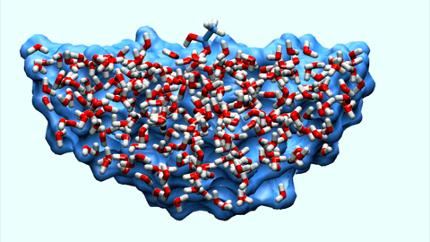

### Hi and welcome 👋

#### I am a computational chemist 👩🏻‍💻. 
Here you can find a few scripts that 
I wrote during my compchem journey 
plus other coding I have been mostly 
doing for fun.

- 🔭 I’m currently at the very end of my PhD (few months left)
- 🌱 I’m currently learning ML with Python
- 👯 I’m looking for a new job/career in science
- 💬 Ask me about anything you think I could have an answer for
- 📫 How to reach me: carmen.baiano@sns.it
- ⚡ Fun fact: As chemist I only perform experiments in my kitchen 

